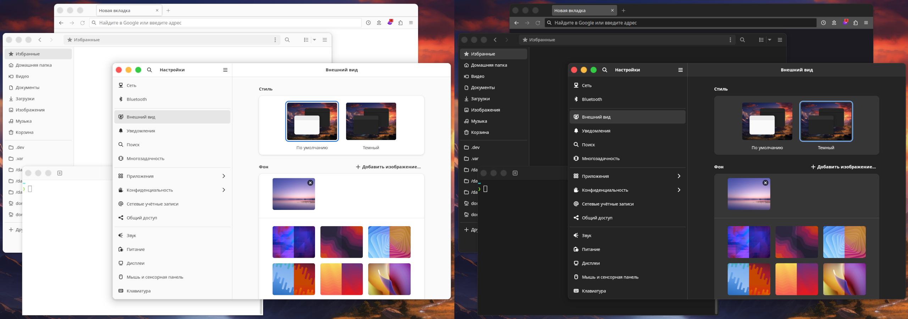

# macOS-like controls for libadwaita and adw-gtk3
- A very simple hack with minimal changes.
- No resources, just plain `.css` files.

> [!WARNING]
> Custom themes will most likely not work well!

## Installation
1. Make sure to install and enable [adw-gtk3](../../../../lassekongo83/adw-gtk3) theme.
1. Clone or download this repository.
1. Copy both folders [gtk-3.0](gtk-3.0) and [gtk-4.0](gtk-4.0) to your `~/.config` directory.
1. Relog and you're done! Enjoy.

## Flatpak
- You have to run those commands as a user.
```sh
flatpak --user override --filesystem=xdg-config/gtk-3.0:ro
flatpak --user override --filesystem=xdg-config/gtk-4.0:ro
```
